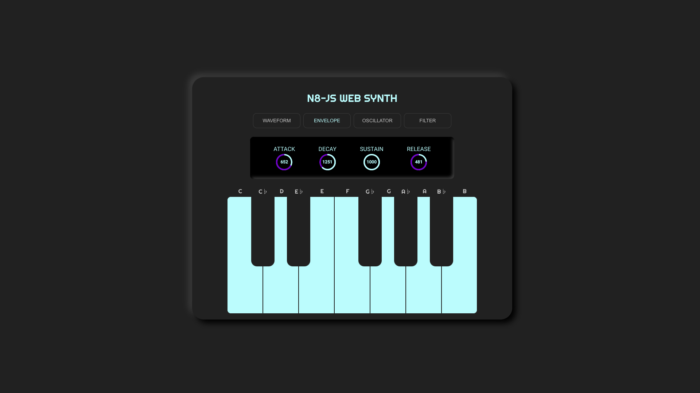

# N8-JS Web Synth

The N8-JS Web Synth lets users shape sounds and play songs online.

## Features
#### Waveform Controls
* Type
* Octave
* Gain
* Distortion

#### Envelopes
* Attack
* Decay
* Sustain
* Release

#### Oscillators
* Count
* Unison Detune
* Noise Gain

#### Filters
* Low-pass or High-pass
* Frequency
* Q

## Technology
The primary technology used for this project includes:

* [React](https://github.com/facebook/create-react-app)
* [Web Audio API](https://developer.mozilla.org/en-US/docs/Web/API/Web_Audio_API)
* [TypeScript](https://www.typescriptlang.org/)

## Scripts

Standard `react`/`node` scripts run as standard: 
* `npm start`
* `npm test`
* `npm run build`

## Current Architecure
* The `classes/audioContextWrapper.js` file is our main audio controller. It is  responsible for creating oscilators, playing, stopping and destroying them, based on calling `playNote(note,octave)` and `stopNote(note,octave)`.

* `keyboard.tsx` is the `React` component responsible for instantiating its own `audioContextWrapper` and calling `playNote` and `stopNote` on it via user input of click events.

Right now the `keyboard` passes 

